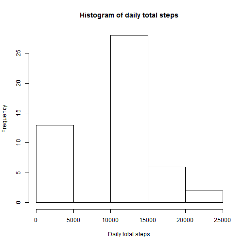
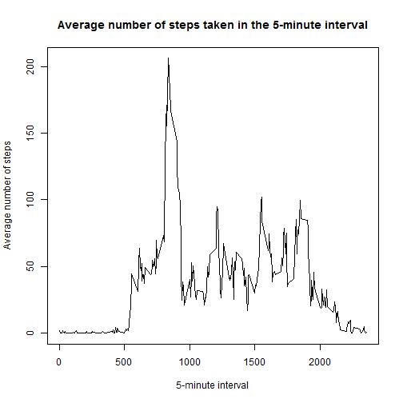
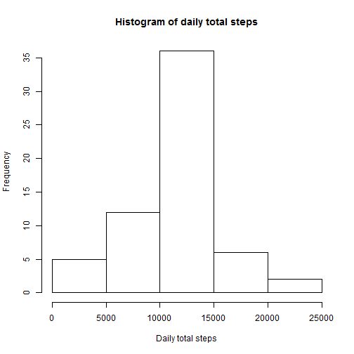
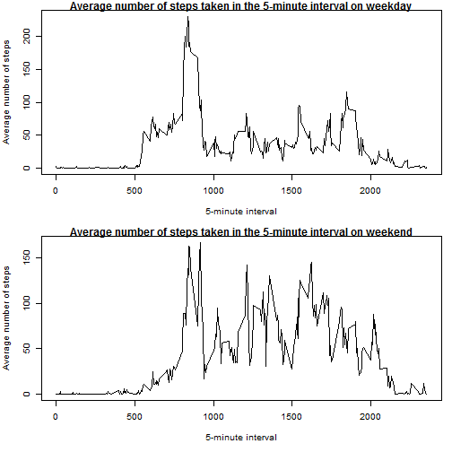

Loading and processing the data


```r
library(dtplyr)
data<-read.table(file = "activity.csv", sep = ",", header = TRUE, na.strings = "NA")
```

What is mean total number of steps taken per day?


```r
hist(tapply(data$steps, data$date, sum, na.rm = TRUE), main = "Histogram of daily total steps", xlab = "Daily total steps")
```



```r
mean(tapply(data$steps, data$date, sum, na.rm = TRUE))
```

```
## [1] 9354.23
```

```r
median(tapply(data$steps, data$date, sum, na.rm = TRUE))
```

```
## [1] 10395
```

What is the average daily activity pattern?


```r
dailyActivity<-data.frame(interval=names(tapply(data$steps, data$interval, mean, na.rm = TRUE)), steps=tapply(data$steps, data$interval, mean, na.rm = TRUE), stringsAsFactors = FALSE)
with(dailyActivity, plot(interval, steps, type = "n", main ="Average number of steps taken in the 5-minute interval", xlab ="5-minute interval", ylab ="Average number of steps", xaxt = "n"))
lines(dailyActivity$interval, dailyActivity$steps)
axis(side=1, at=seq(0,2500,500))
```



```r
dailyActivity[which.max(dailyActivity$steps),]
```

```
##     interval    steps
## 835      835 206.1698
```

Imputing missing values


```r
missingValue<-data[!complete.cases(data),]
nrow(missingValue)
```

```
## [1] 2304
```

```r
missingValue$steps<-dailyActivity$steps[match(missingValue$interval, dailyActivity$interval)]
newdata<-data
newdata$steps<-ifelse(is.na(newdata$steps)==TRUE, missingValue$steps[missingValue$interval %in% newdata$interval], newdata$steps)
hist(tapply(newdata$steps, newdata$date, sum), main = "Histogram of daily total steps", xlab = "Daily total steps")
```



```r
mean(tapply(newdata$steps, newdata$date, sum))
```

```
## [1] 10766.19
```

```r
median(tapply(newdata$steps, newdata$date, sum))
```

```
## [1] 10766.19
```

Are there differences in activity patterns between weekdays and weekends?


```r
newdata$dayofweek<-weekdays(as.Date(newdata$date))
weekend<-c("Saturday", "Sunday")
newdata$dayofweek<-factor((newdata$dayofweek %in% weekend), levels= c(FALSE, TRUE), labels=c("Weekday", "Weekend"))
weekdaydata<-newdata[newdata$dayofweek=="Weekday",]
weekenddata<-newdata[newdata$dayofweek=="Weekend",]
weekdaysteps<-data.frame(interval=names(tapply(weekdaydata$steps, weekdaydata$interval, mean)), steps=tapply(weekdaydata$steps, weekdaydata$interval, mean), stringsAsFactors = FALSE)
weekendsteps<-data.frame(interval=names(tapply(weekenddata$steps, weekenddata$interval, mean)), steps=tapply(weekenddata$steps, weekenddata$interval, mean), stringsAsFactors = FALSE)
par(mfrow=c(2,1),mar=c(5,4,1,1),cex=0.8)
with(weekdaysteps, plot(interval, steps, type ="n", main ="Average number of steps taken in the 5-minute interval on weekday", xlab ="5-minute interval", ylab ="Average number of steps", xaxt = "n"))
lines(weekdaysteps$interval, weekdaysteps$steps)
axis(side=1, at=seq(0,2500,500), cex=0.5)
with(weekendsteps, plot(interval, weekendsteps$steps, type ="n", main ="Average number of steps taken in the 5-minute interval on weekend", xlab ="5-minute interval", ylab ="Average number of steps", xaxt = "n"))
lines(weekendsteps$interval, weekendsteps$steps)
axis(side=1, at=seq(0,2500,500), cex=0.5)
```




